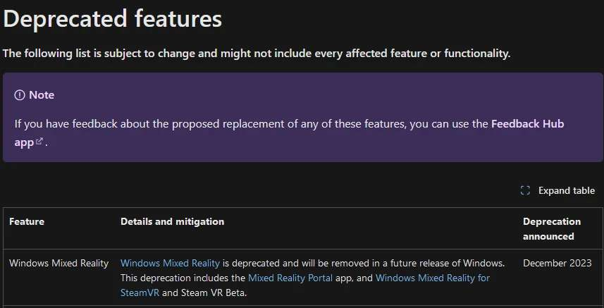

# Retaining Windows Mixed Reality support on Windows 11

<figure><figcaption>
Win11 will drop support for WMR devices sometime soon and remove it entirely in Q4 2024 for Windows Home and Pro versions, and Q4 2025 for Windows Enterprise versions.
</figcaption></figure>

One way of retaining WMR support is to stay on Windows 11 version 23H2 (or below) by disabling Windows feature updates but keeping security updates. _Those are important!_

## The easy 2-button way

The easiest way I know for changing what updates you get is by using WinUtil ([https://github.com/ChrisTitusTech/winutil](https://github.com/ChrisTitusTech/winutil)):&#x20;

1. Open Powershell as **admin** and paste: `iwr -useb https://christitus.com/win | iex`
2. Go to the **Updates** tab on top and click **Security Updates.**
3. _You can close the window and/or explore the other features this program provides._
4. Reboot your computer.

<figure><figcaption></figcaption></figure>

_To revert this change you open WinUtil, go to **Updates** and press **Default Settings.**_

## The native Windows way


Requires Windows 11 Pro or Enterprise


1. Open start and search for **Edit group policy**\
   .png>)
2.  Go to **Computer Configuration** -> **Administrative Templates -> Windows Components -> Windows Update.**\

    <figure><figcaption></figcaption></figure>
3.  Open **Manage updates offered from Windows Update** and double click **Select the target Feature Update version**, tick **Enabled** and fill in the options like stated in the screenshot below:\

    <figure><figcaption></figcaption></figure>

4. Press **Apply** and **OK**, close all windows and reboot your computer.\
   _Your windows installation will now stay on Windows 11 version 23H2 indefinitely._
